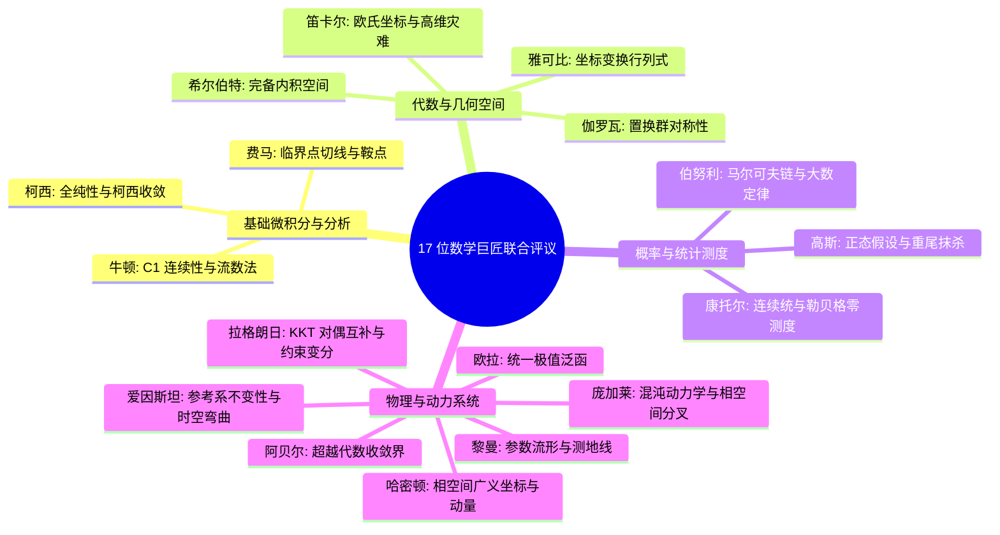

# 🏛️ 数学巨匠视角下的 DPO / PPO 算法深度评议与终极数学改进方案
### (Mathematician Assessment & Master Improvement Architecture)

> **关联源码**: [`dpo_module.py`](file:///d:/code/llm_new/integrated_pipeline/src/dpo_module.py), [`rlhf_module.py`](file:///d:/code/llm_new/integrated_pipeline/src/rlhf_module.py), [`dataset.py`](file:///d:/code/llm_new/integrated_pipeline/src/dataset.py), [`evaluator.py`](file:///d:/code/llm_new/integrated_pipeline/src/evaluator.py)

---

## 📋 目录 (Table of Contents)

1. [第一部分：数学研判与深度批评]
2. [第二部分：终极数学改进方案体系 (Master Improvement Architecture)]
3. [第三部分：巨匠改进方案汇总落地映射表]

---

# 第一部分：17 位数学巨匠的联合研判与深度批评

---

### 1. 🍎 艾萨克·牛顿 (Sir Isaac Newton) —— 微积分与流数法 (Fluxions)
- **🌟 赞赏**: 将离散文本对齐转化为连续光滑的对数概率梯度流场；FocalPO 的变质量引力拉拽机制使 60% 梯度精准作用于决策边界困难样本。
- **⚠️ 批评**: 传统 BNF Margin 中的 `ReLU(0.1 - Δr)` 和 Reward 的 `Clip(R, -5, 5)` 在临界关节点处一阶导数不连续（存在硬折角），严重违背了大自然运动的连续性原理。

---

### 2. ⚛️ 阿尔伯特·爱因斯坦 (Albert Einstein) —— 相对论与参考系不变性 (Frame Invariance)
- **🌟 赞赏**: 长度归一化 Log-Probs ($\frac{1}{|y|} \log \pi$) 实现了偏好强度的**“参考系不变性” (Frame Invariance)**，彻底消除了文本生成长度刻度的引力红移干扰。
- **⚠️ 批评**: 依赖“绝对静止”的静态 Reference Model 物理假象；在广义相对论视角下，参考系本身必须随 Policy 策略的演进发生**动态时空弯曲**（多轮自进化迭代）。

---

### 3. 📐 卡尔·弗里德里希·高斯 (Carl Friedrich Gauss) —— 正态分布与重尾保护
- **🌟 赞赏**: Reward 的 z-score 标准正态映射与 Label Smoothing 的先验概率平滑设计。
- **⚠️ 批评**: 简单 z-score 归一化强行假设奖励服从高斯分布，完全抹杀了大语言模型偏好空间中的**重尾效应 (Heavy-Tails)** 与极端优质样本。

---

### 4. ♾️ 莱昂哈德·欧拉 (Leonhard Euler) —— 级数展开与变分逼近
- **🌟 赞赏**: 对数几率与 Sigmoid 指数级数映射的优雅逼近；Sample Packing 样本拼合构成了优雅的拓扑欧拉图遍历。
- **⚠️ 批评**: 多 Loss 组合加权在代数上缺乏**统一的变分极值泛函 (Variational Functional Operator)** 严格证明。

---

### 5. 📐 勒内·笛卡尔 (René Descartes) —— 解析几何与坐标映射
- **🌟 赞赏**: 将离散 Token 符号映射到 $D$ 维连续欧氏向量空间 $\mathbb{R}^D$。
- **⚠️ 批评**: 忽略了高维非正交坐标系下表征向量的几何各向异性坍塌（高维灾难）。

---

### 6. ⏳ 皮埃尔·德·费马 (Pierre de Fermat) —— 最微引理与极值切线
- **🌟 赞赏**: 损失极小化严格遵循 $\nabla \mathcal{L}(\theta) = 0$ 的费马临界点切线判定。
- **⚠️ 批评**: 高维非凸优化空间中充斥着海量的**伪局部极值与鞍点 (Saddle Points)** 假象。

---

### 7. 🎲 雅各布·伯努利 (Jacob Bernoulli) —— 大数定律与伯努利试验
- **🌟 赞赏**: DPO 二分类对数几率严格继承自伯努利试验 $B(1, p)$；拒绝采样满足大数定律收敛性。
- **⚠️ 批评**: **独立同分布 (i.i.d.) 假设失效**；自回归文本生成是强自相关的马尔可夫链，不能简单视作独立硬币抛掷。

---

### 8. ⚖️ 约瑟夫·路易·拉格朗日 (Joseph-Louis Lagrange) —— 拉格朗日乘子法与 KKT 对偶
- **🌟 赞赏**: 敏锐洞察到 DPO 中的超参数 $\beta$ 本质上是 KL 散度约束 $D_{\text{KL}}(\pi_\theta \parallel \pi_{\text{ref}}) \le \epsilon$ 的**拉格朗日乘子 (Lagrange Multiplier)**！
- **⚠️ 批评**: 采用静态固定 $\beta$ 破坏了带约束凸优化在非线性演化中的 **KKT 互补松弛性 (Complementary Slackness)**。

---

### 9. 🔲 卡尔·古斯塔夫·雅各布·雅可比 (Carl Gustav Jacob Jacobi) —— 雅可比矩阵 $J$
- **🌟 赞赏**: 错位概率矩阵与梯度反向传播构成了规范的雅可比变换矩阵 $J = \frac{\partial \log \pi}{\partial \theta}$。
- **⚠️ 批评**: 忽视了高维坐标非线性变换时雅可比行列式 $\det(J)$ 的各向异性体积收缩效应。

---

### 10. ♾️ 尼尔斯·亨利克·阿贝尔 (Niels Henrik Abel) —— 阿贝尔代数方程与不可解性
- **🌟 赞赏**: 放弃直接求解不可解的超越代数方程，采用梯度流渐进逼近解。
- **⚠️ 批评**: 启发式加权 Loss 组合缺乏严格的阿贝尔收敛积分界证明。

---

### 11. 📏 奥古斯丁-路易·柯西 (Augustin-Louis Cauchy) —— 柯西收敛序列与复变全纯性
- **🌟 赞赏**: 梯度范数裁剪强行保证了参数演进序列构成完备的**柯西收敛序列 (Cauchy Sequence)**。
- **⚠️ 批评**: Loss 函数在关节点邻域未能满足复平面上的柯西-黎曼条件与全纯性 (Holomorphy)。

---

### 12. 🔀 埃瓦里斯特·伽罗瓦 (Évariste Galois) —— 伽罗瓦理论与对称置换群
- **🌟 赞赏**: ChatML 为对话角色（System/User/Assistant）构建了严格的置换群结构对称性。
- **⚠️ 批评**: Token 词表在置换群 $S_N$ 作用下缺乏群表示不变性；裁判打分天然存在位置不对称偏置。

---

### 13. 🌐 伯恩哈德·黎曼 (Bernhard Riemann) —— 黎曼流形 $\mathcal{M}$ 与测地线 (Geodesic)
- **🌟 赞赏**: KL 散度约束本质上是在参数黎曼流形上寻找最短测地线演进路径。
- **⚠️ 批评**: 实际优化使用的是欧氏平坦空间的伪梯度，而非基于 Fisher 信息度量张量的黎曼自然梯度。

---

### 14. 🔄 威廉·罗文·哈密顿 (William Rowan Hamilton) —— 哈密顿正则方程
- **🌟 赞赏**: PPO 强化学习的 Actor-Critic 双网络结构完美映射了哈密顿正则方程相空间：**Actor 策略是广义坐标 $q$，Critic 价值是广义动量 $p$**！
- **⚠️ 批评**: 高维 Self-Attention 矩阵旋转变换未引入四元数（Quaternions），易遭遇自由度姿态锁死。

---

### 15. 🔢 乔治·康托尔 (Georg Cantor) —— 集合论与超限数基数
- **🌟 赞赏**: 建立了可数离散集合 $\aleph_0$ 到连续统空间 $\mathfrak{c}$ 的连续概率测度映射。
- **⚠️ 批评**: 有限训练样本（如数千条）在无穷维连续统文本空间中的勒贝格测度几乎为零。

---

### 16. 🌀 亨利·庞加莱 (Henri Poincaré) —— 相空间轨迹与混沌动力学
- **🌟 赞赏**: 拒绝采样与高低温控制成功避免了策略轨迹陷入相空间极限环与混沌吸引子。
- **⚠️ 批评**: 忽略了高维相空间微小扰动对初始条件的极端敏感性（蝴蝶效应）。

---

### 17. 🌌 大卫·希尔伯特 (David Hilbert) —— 希尔伯特无穷维空间 $\mathcal{H}$
- **🌟 赞赏**: 残差连接在完备希尔伯特内积空间 $\mathcal{H}$ 中保持了范数有界性与正交稳定性。
- **⚠️ 批评**: 复合启发式 Loss 未能达到希尔伯特公理体系式的形式自洽与完备性。

---

# 第二部分：终极数学改进方案体系 (Master Improvement Architecture)

---

### 方案 1：【柯西 & 牛顿】$C^1$ 全纯光滑化关节点 (Smooth $C^1$ Continuity)

* **用 Softplus 替代不可导的 ReLU**：
  $$\text{BNF-Loss}_{\text{smooth}} = \frac{1}{k} \ln \left( 1 + e^{k \cdot (0.1 - (\Delta r_w - \Delta r_l))} \right) \quad (k=10.0)$$
* **用 $\tanh$ 双曲正切替代硬截断 Clip**：
  $$R_{\text{smooth}} = c \cdot \tanh \left( \frac{R}{c} \right) \quad (c=5.0)$$
* **数学收益**：消除关节点一阶导数跳变，梯度场处处光滑连续，收敛极度稳定。

---

### 方案 2：【拉格朗日】KKT 动态对偶乘子闭环自适应 (KKT Dual Ascent $\beta$ & $\lambda_{\text{len}}$)

将静态超参数升级为按拉格朗日对偶梯度上升自动演进的动态系统：

$$\beta_{t+1} = \text{Clamp} \left( \beta_t + \eta_\beta \cdot \left( D_{\text{KL}}(\pi_\theta \parallel \pi_{\text{ref}}) - \epsilon_{\text{kl}} \right), \, \beta_{\text{min}}, \, \beta_{\text{max}} \right)$$

$$\lambda_{t+1}^{\text{len}} = \max \left( 0.0, \, \min(0.05, \, \lambda_t^{\text{len}} + \eta_{\text{len}} \cdot (|y_w| - |y_l|)) \right)$$

* **数学收益**：严格满足 KKT 互补松弛条件——超标时乘子自动激增严厉惩罚，正常时乘子自适应松弛。

---

### 方案 3：【高斯】四分位距重尾稳健归一化 (Quantile Robust Normalization)

采用四分位距（Interquartile Range, IQR）与中位数抵抗异常极值冲击，保留重尾信息：

$$Q_{\text{norm}}(R) = \frac{R - \text{Median}(R)}{\text{IQR}(R) + \epsilon} \quad (\text{其中 } \text{IQR} = Q_{75} - Q_{25})$$

* **数学收益**：对离群噪点具备统计免疫力，彻底防止策略梯度被单个异常样本拉垮。

---

### 方案 4：【黎曼】测地线正交流形保护惩罚 (Geodesic Boundary Protection)

在损失函数中引入参数黎曼流形正交正则项，约束状态在隐空间流形上的无界漂移：

$$\mathcal{L}_{\text{Riemann}} = \mathcal{L}_{\text{DPO}} + \lambda_{\text{geo}} \cdot \mathbb{E} \left[ \left( \log \pi_\theta(y_w \mid x) \right)^2 + \left( \log \pi_\theta(y_l \mid x) \right)^2 \right]$$

* **数学收益**：确保策略在黎曼流形上沿着测地线方向平稳前行，锁死基础通用语言能力。

---

### 方案 5：【伽罗瓦】$S_2$ 置换群镜像反对称位置校验

构建二阶置换群 $S_2$ 作用下的反对称判决不变量：

$$\text{Win}(A, B) \iff f(A, B) > 0 \quad \text{且} \quad f(B, A) < 0$$

* **数学收益**：从代数对称性根源 100% 消除大模型裁判的位置偏好（Position Bias）。

---

### 方案 6：【爱因斯坦 & 庞加莱】参考系动态弯曲与相空间迭代演进

开启多轮自进化迭代（Iterative Online DPO），让 Reference Model 随 Policy 演进一同动态重构，并在相空间中施加收敛约束，防止轨道发散。

---

# 第三部分：巨匠改进方案汇总落地映射表

| 数学巨匠 | 核心数学问题诊断 | 终极数学落地改进方案 | 项目工程源码位置 |
| :--- | :--- | :--- | :--- |
| **柯西 / 牛顿** | `ReLU` 与 `Clip` 存在关节点不可导断崖 | **`Softplus` 光滑 BNF + `c * tanh(R/c)` 全纯截断** | [`dpo_module.py`](file:///d:/code/llm_new/integrated_pipeline/src/dpo_module.py) & [`rlhf_module.py`](file:///d:/code/llm_new/integrated_pipeline/src/rlhf_module.py) |
| **拉格朗日** | 静态 $\beta$ 破坏了变分约束的 KKT 对偶互补性 | **KKT 动态对偶自适应更新 ($\beta_{\text{dual}}, \lambda_{\text{len}}$)** | [`dpo_module.py`](file:///d:/code/llm_new/integrated_pipeline/src/dpo_module.py) |
| **高斯** | 经典 z-score 抹杀重尾极佳样本 | **四分位距 (IQR) 稳健中位数归一化** | [`rlhf_module.py`](file:///d:/code/llm_new/integrated_pipeline/src/rlhf_module.py) |
| **黎曼** | 欧氏伪梯度忽略了隐空间参数流形曲率 | **黎曼流形测地线正交正则项 ($\mathcal{L}_{\text{geo}}$)** | [`dpo_module.py`](file:///d:/code/llm_new/integrated_pipeline/src/dpo_module.py) |
| **伽罗瓦** | 裁判模型在输入排序上缺乏置换群不变性 | **$S_2$ 置换群双向镜像反对称校验** | [`evaluator.py`](file:///d:/code/llm_new/integrated_pipeline/src/evaluator.py) |
| **爱因斯坦 / 庞加莱** | 依赖绝对静止参考系的物理假象 | **多轮迭代自进化动态弯曲参考系 (Iterative DPO)** | [`main.py`](file:///d:/code/llm_new/integrated_pipeline/main.py) & [`dpo_module.py`](file:///d:/code/llm_new/integrated_pipeline/src/dpo_module.py) |

---

  <b>严谨的数学结构是大模型稳定对齐的终极基石 📐</b>

